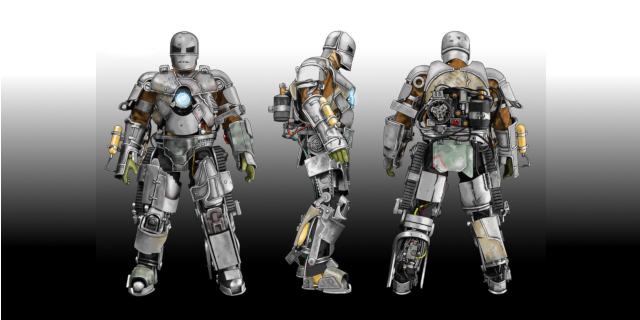

# Mark 001

    
    

        Picture source: <a href="url">https://www.planetminecraft.com/skin/ironman-mark-1-18/</a>
    

    

## A Quiz app for my first Flutter project.
----
It's a sigle screen app, just for the first contact with the framework and Dart.
 
Feel free to hack and get started yourself with flutter to. 

### Getting Started

This project is a starting point for a Flutter application.

A few resources to get you started if this is your first Flutter project:

- [Lab: Write your first Flutter app](https://flutter.dev/docs/get-started/codelab)
- [Cookbook: Useful Flutter samples](https://flutter.dev/docs/cookbook)

For help getting started with Flutter, view our
[online documentation](https://flutter.dev/docs), which offers tutorials,
samples, guidance on mobile development, and a full API reference.

